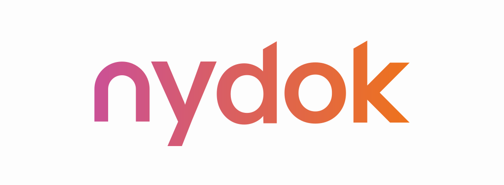

<figure markdown>
  { width="500" }
</figure>

Welcome to the **nydok** documentation.

**nydok** is a combined specification writing and testing framework, for producing consistent and traceable specification documents.

Write your requirements and risk assessment alongside your code, ensuring 1:1 mapping between requirements and the code you're writing.

## Features

Some notable features are:

- Lets you write specification documents including requirements as normal Markdown.
- Keeps track of which requirements are missing test cases.
- Supports a risk assessment process where you can link mitigations to your requirements.
- Can generate several types of reports in Markdown format, such as:
    - Traceability matrix
    - Code review reports (Gitlab)
    - Risk assessment report
    - Test summary report
    - CI pipeline logs report (Gitlab)

nydok is written and maintained by [Nykode Therapeutics](https://nykode.com/) and powers the CSV[^2] documentation for our in-house developed tools.

Please create an issue on Github with any feedback you have.

[^1]: Through it's support for JUnit XML reports more or less any language is supported.
[^2]: Computerized System Validation
