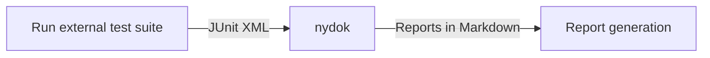

# Writing test cases

As nydok is integrated into py.test, writing tests within py.test is naturally the recommended way of writing tests.

However, in most settings you'll need to integrate tests from other software. nydok support JUnit XML format in case you need to integrate other software tests.


## Writing test cases with py.test

Given a requirement in a specification file with no test case implemented, nydok will fail the `Requirement` with a message like the following:

``` title="py.test output"
Requirement FR100 (/project/tests/myspec.spec.md:105) is missing implementation:

@testcase("FR100")
def test_something():
    raise NotImplementedError("To be implemented")
```

As given by the example message, the requirement on line `105` in `myspec.spec.md` is missing an implementation (test case). You can simply copy the example to get started, nydok will suggest a test function name for you. `@testcase` can be import from nydok itself, so the final test case can look like:

```python title="test_specs.py"
from nydok import testcase

@testcase("FR100")
def test_something():
    # Your test code goes here
    ...

```

### Testing multiple requirements with one test case

Sometimes you want to cover multiple requirements with a single test case. You can do this by using a list of requirements to cover for the test:

```python
@testcase(["FR100", "FR101"])
def test_something():
    ...

```

### Providing input/output data to test case


#### Actual test data

You can specify input/output data to `@testcase` and nydok will use that information when generating the test report. See the following example:

```python
@testcase(
    "UR001",
    io=[
        ((1, 2, 3), 6),
        ((5, 2, 1), 8)
    ]
)
def test_sum(io=None):
    for input_data, output_data in io:
        assert sum(input) == output
```

The data provided is a list of tuples, each tuple having two entries: input and output.

The result will be added as markdown to the test report and will render like the following table:

Input     | Output
--------- | ------
(1, 2, 3) | 6
(5, 2, 1) | 8

#### For documentation only

Sometimes you have datasets that are not suitable for inclusion in a test report document. You can still use the `io` keyword to supply data solely for documentation purposes. These values could in turn fetch data from a defined data stucture, e.g. a large dictionary in the test file or an external file with test data.

```python
from mymodule import count_population

LARGE_TEST_DATASET = {...}

@testcase(
    ["POP001", "POP010"],
    io=[
        ('chicago_dataset', '3 million'),
        ('newyork_dataset', '9 million'),
    ]
)
def test_count_format_population(io=None):
    for input_key, output_key in io:
        population = count_population(LARGE_TEST_DATASET[input_key])
        assert format_population(population, 'million') == output
```

This will then render like the following table:

Input            | Output
---------------- | ----------
chicago_dataset  | 3 million
newyork_dataset  | 9 million


### Assigning a specific test case ID

By default nydok will generate test case IDs by incrementing the ID `TCnnn` as it encounters tests. Hence, omitting a specific test case will give your test cases IDs like `TC001`, `TC002` etc. Adding a new test will shift the IDs of the subsequent test cases. Depending on context, this can work fine and removes a lot of manual work, but if you need to assign specific IDs to the test cases you can do so like the following:

```python
@testcase(
    "FR100",
    testcase_id="TEST001"
)
def test_something():
    ...

```


### Other functionality

The `@testcase` decorator supports a few more keyword arguments, demonstrated here:

```python
@testcase(
    "FR100",
    desc="Requirement doesn't need test per risk assessment",
    ref_ids=["UR100"],
)
def test_something():
    ...
```

- **desc**: Description of the test case. Used in test report heading.
- **ref_ids**: Adds listed IDs as references to all referenced requirements. Works similarily to adding them in the requirement (which is recommended for traceability).


## Mixing test cases and normal tests

Since nydok integrates with py.test, it can run your requirements, test cases and normal unit tests in one go. You therefore have the possibility to mix and match like the following:

```python title="Mixing test cases and normal unit tests"

# Will be asserted but not included in nydok
def test_something():
    ...

# Will be asserted and included as a test case
@testcase("FR001")
def test_requirement():
    ...

```

## Using external tests (JUnit XML)

If you'd like to integrate other testing tools and languages into nydok, you can use the JUnit XML functionality.
Similarily to `test_*.py` files, nydok will scan any `.junit.xml` files in it's provided paths and assume they are JUnit XML result files.

In order to be able to reference requirements, the `name` attribute of the `<testcase>` in the XML file has to follow a certain pattern[^1]. By default the pattern is the same as in `Specification` files, but without the leading `- `.

Example:

```xml title="result.junit.xml"
<?xml version="1.0" encoding="UTF-8"?>
<testsuites name="Mocha Tests" time="2.593" tests="2" failures="0">
  <testsuite name="Root Suite" timestamp="2022-08-23T07:37:17" tests="0" file="spec.js" failures="0" time="0">
  </testsuite>
  <testsuite name="Uploading works" timestamp="2022-08-23T07:37:17" tests="1" failures="0" time="2.593">
    <testcase name="FR001: Module must support uploading files" time="1.563" classname="foo" failure="false" error="false" success="true">
    </testcase>
  </testsuite>
</testsuites>
```

should pass the requirement `FR001`. The description part of the `name` attribute is also added as description of the test (similar to `desc` in `@testcase` for Python).

To utilize this functionality, you would normally do something like the following in your test pipelines:




[^1]: A custom regex can be provided to support other naming patterns, see configuration.
