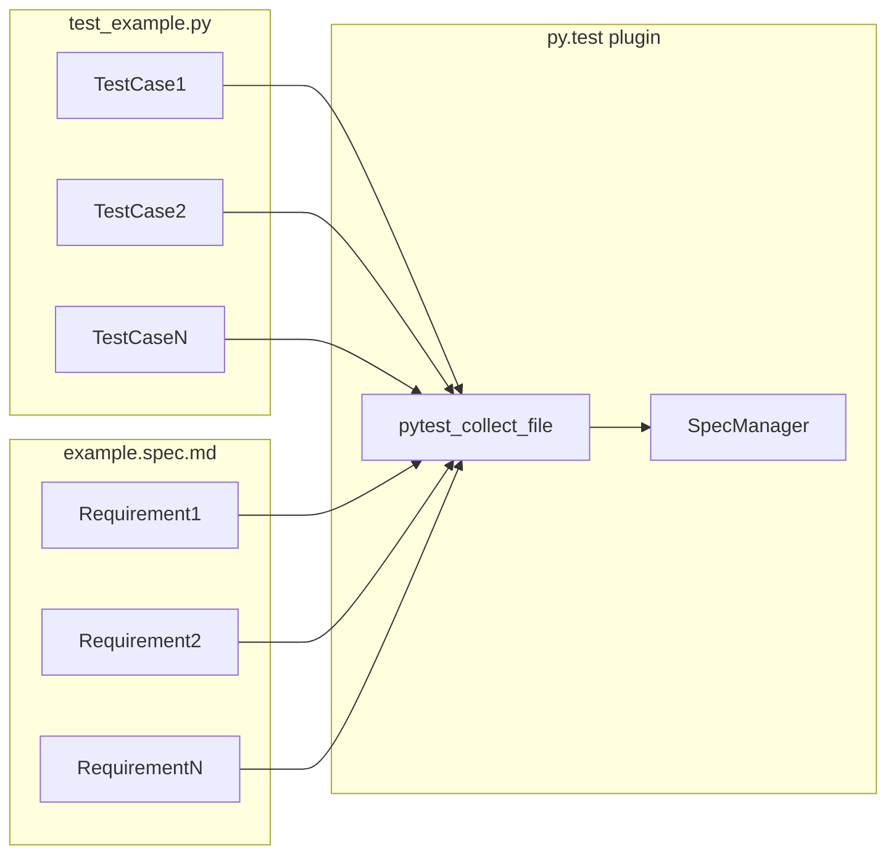
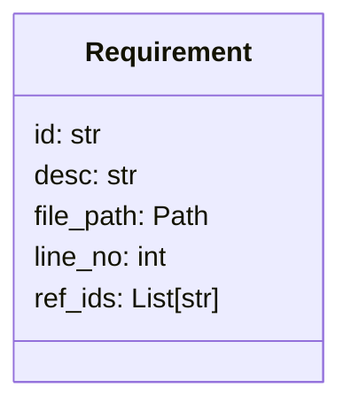
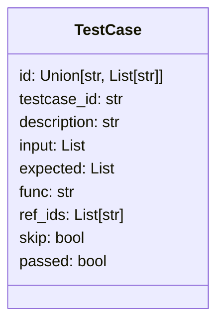

# Testing framework specification

The specification testing part of nydok is written as a plugin for the [py.test](https://www.pytest.org) testing framework.

It's based upon creating specification files in Markdown format, containing requirements that you want tested formatted following a given format. This format is configurable, by default it follows the convention given in this specification.

The plugin is implemented by extending py.test's built in functionality for searching for tests in certain file formats. Every Markdown file is scanned for requirements, each one acting like a test item within py.test. The normal Python tests are augmented by applying a decorator to the relevant functions. This decorator takes an identifier, which is linked to the requirement written in the Markdown documents. Normally, one will therefore have one Python py.test test item and one Markdown py.test test item for each requirement. One can mix normal tests testing given requirements (i.e. with a decorator) and other tests (i.e. without decorator).

The result is exported to a json file, which can be used by the CLI to generate reports.

## Terminology

- **Specification**: A file in Markdown format, from which requirements will be collected.
- **Requirement**: A line in a Markdown file in given format, describing desired functionality. What kind of requirement this is (user, functional, etc.) is not specified inside nydok, but rather indicated by the user by the context in which the requirement is given (e.g. by it's given ID or the title of the containing `Specification`).
- **Test Case**: A test function testing the implementation of a `Requirement`.
- **Reference**: A reference (ID) to another Requirement or to items in other documents (e.g. from risk assessments).
- **Risk Assessment**: An evaluation of what can go wrong, either in the context of a piece of software, function or module, or in the case of higher level events.

## High level functionality

The following requirements relates to the high level functionality of the plugin.

### Functional requirements

- FR001 [UR010,UR032]: Plugin must support parsing specification files in Markdown format, checking for a matching test case per requirement.
- FR010 [UR070]: Plugin must support tracking input/output for each test case.
- FR011 [UR040]: Plugin must support tracking ids to other references for each test case.
- FR020 [UR031]: Plugin must support changing regex used for parsing by command line argument.
- FR021 [UR031]: Plugin must support changing regex used for parsing by configuration file.
- FR030 [UR033]: One `Test Case` must be able to reference one or several `Requirement`s.

## py.test integration

The plugin is implemented using py.test's [hook system](https://docs.pytest.org/en/7.1.x/how-to/writing_hook_functions.html). Py.test has it's internal pipeline, with different hooks at each stage. By implementing custom functionality at the relevant steps, one can hook functions into the general pipeline.

Py.test has the following categories of hooks (used categories in bold):

- Bootstrapping hooks
- Initialization hooks
- **Collection hooks**
- **Test running (runtest) hooks**
- Reporting hooks
- Debugging/Interaction hooks

This plugin is utilizing hooks in the following categories:

- Collection hooks:
    - `pytest_collect_file`: Called once per file encountered on the file system. Used to collect Markdown files for parsing of `Requirement`s. One `SpecItem` is returned per parsed `Requirement`, adding it into py.test's general list of Items to test.
    - `pytest_collection_finish`: Used to ensure that `Requirement` tests are run after `Test Case` (code) tests. This is needed since a `Requirement` test needs to know that an corresponding `Test Case` test exists and that it passed.
- Test running (runtest) hooks:
    - `pytest_runtest_call`: Used to register the `Test Case` tests and whether it passed or failed.

Each `Requirement` registers a `SpecItem`, which inherits from py.test's own `pytest.Item`. Here, a `runtest()` function is called by py.test, where the general logic for testing the `Requirement` is implemented. For instance, this function can raise `MissingTestCaseException` or `DuplicateRequirementException` for failing a test.

## Requirement and Test Case collection

## Specifications

A `Specification` is a file in Markdown format, containing descriptions and requirements.

A `Requirement` is a representation of a line in the specification file in a given format, describing desired functionality for the application or code module.

In the codebase, `Requirement`s are represented by `Requirement` objects, which keeps track of the following attributes:

- Identifier (ID)
- Description
- Path to specification file
- Line number for requirement in specification file
- References to other IDs (specifications or test cases)

### Functional requirements

- FR100 [UR030]: Given two `Requirement`s referencing the same requirement ID, the second item must raise a `DuplicateRequirementException`.
- FR110 [UR040]: A `Requirement` must be able to contain references represented as text strings.
- FR120 [UR32]: A `Requirement` must have a test case associated with it, otherwise the `Requirement` test must fail.

## Test Cases

An `Test Case` is a representation of a test function, testing the implementation of a `Requirement`.

An `Test Case` object keeps track of the following attributes:

- One or more requirement identifiers (IDs)
- Test case identifier
- Description
- Input data
- Expected output data
- Test function name
- Risk assessment identifiers
- Other reference identifiers
- Whether `Test Case` is for adding metadata only (no real test, test function is skipped)
- Whether `Test Case` passed or failed

### Functional requirements

- FR200 [UR020]: Given two Test Cases referencing the same requirement ID, the second item must raise a `DuplicateRequirementException`.

## SpecManager

The specification manager, `SpecManager`, keeps track of all `Requirement`s and `Test Case`s and has functionality for linking them together.

It's a simple class with functionality for registering both `Requirement`s and `Test Case`s and writing them out to a JSON file.

## JUnit support

The plugin supports JUnit result files as a source for test results. These files are in xml format. The plugin can parse these files and add the results to the test report.

### Functional requirements:

- FR270 [UR045]: Plugin must support JUnit XML result files as test result source.
- FR280 [UR045]: Given several test cases within a test suite sharing the same name, the plugin must select the first failing test case. If no test cases are failing, the first test case must be selected.

## Risk Assessment

In order to implement complete traceability of test cases and their respective risk assessments, a system for parsing risk assessment criteria, and being able to link these together with specified requirements must be available.

This is achieved by having a risk assessment file in YAML format, containing risk assessment items. Each risk assessment item contains the following metadata:

- Requirement ID
- Prior severity
- Prior probability
- Prior detectability
- Mitigating action
- Mitigating requirement IDs
- Residual severity
- Residual probability
- Residual detectability

### Risk class

The risk class is calculated from the probability and severity according to the following table, yielding a prior risk class and a residual risk class:

<table>
  <thead>
    <tr>
      <th></th>
      <th colspan="3" style="text-align: center">Probability</th>
    </tr>
    <tr>
      <th>Severity</th>
      <th>Low</th>
      <th>Medium</th>
      <th>High</th>
    </tr>
  </thead>
  <tbody>
    <tr>
      <th>High</th>
      <td>Class 2</td>
      <td>Class 1</td>
      <td>Class 1</td>
    </tr>
    <tr>
      <th>Medium</th>
      <td>Class 3</td>
      <td>Class 2</td>
      <td>Class 1</td>
    </tr>
    <tr>
      <th>Low</th>
      <td>Class 3</td>
      <td>Class 3</td>
      <td>Class 2</td>
    </tr>
  </tbody>
</table>

### Risk priority

The risk priority is calculated from the risk class and detectability according to the following table, yielding a prior risk priority and a residual risk priority:

<table>
  <thead>
    <tr>
      <th></th>
      <th colspan="3" style="text-align: center">Detectability</th>
    </tr>
    <tr>
      <th>Risk Class</th>
      <th>High</th>
      <th>Medium</th>
      <th>Low</th>
    </tr>
  </thead>
  <tbody>
    <tr>
      <th>Class 1</th>
      <td>Medium</td>
      <td>High</td>
      <td>High</td>
    </tr>
    <tr>
      <th>Class 2</th>
      <td>Low</td>
      <td>Medium</td>
      <td>High</td>
    </tr>
    <tr>
      <th>Class 3</th>
      <td>Low</td>
      <td>Low</td>
      <td>Medium</td>
    </tr>
  </tbody>
</table>

### Functional requirements

- FR301 [UR050]: The user must be able to specify `Risk Assessment` in YAML format.
- FR310 [UR050]: If a `Risk Assessment` item is missing mandatory metadata, an error must be raised.
- FR320 [UR050]: The residual risk priority must be calculated according to tables in this specification.
- FR321 [UR051]: The user must be able to specify an acceptable risk priority threshold, if the residual risk priority is above this threshold, an error must be raised. By default, the threshold is set to 'Low'.
- FR330 [UR050]: A `Risk Assessment` must be able to, optionally, link to a requirement mitigating the risk. If the requirement doesn't exist, an error must be raised.